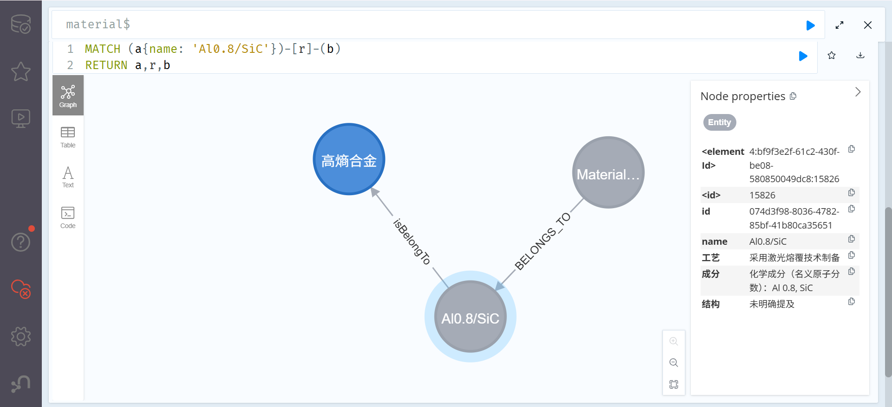
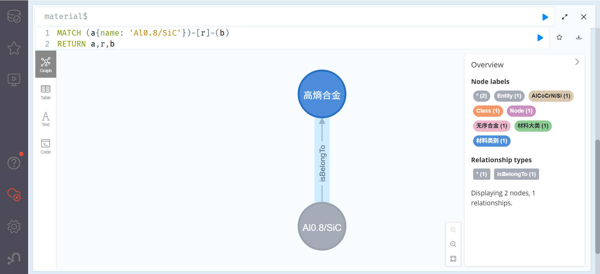

```
MATCH (a{name: 'Al0.8/SiC'})-[r]-(b)
RETURN a,r,b
```


清理后：


(thl) thl@ubuntu:~/2025Fall/Mount-Data-to-KG/project$ python3 main.py
======================================================================
材料知识图谱挂载系统
======================================================================

【步骤1】读取材料数据
----------------------------------------------------------------------
✅ 成功读取材料数据 (索引: 0)

【步骤2】连接Neo4j数据库
----------------------------------------------------------------------
✅ Neo4j 数据库连接成功！

【步骤3】开始多层分类
======================================================================

======================================================================
第一层分类：材料 → 子类型
======================================================================

--- 正在从Neo4j获取 '材料' (elementId=4:bf9f3e2f-61c2-430f-be08-580850049dc8:0) 的分类信息 ---
✅ 找到 7 个子类: 性能, 金属材料, 无机非金属材料, 信息材料, 能源材料, 复合材料, 有机高分子材料
   - 性能: 力学性能, 磁学性能, 加工性能, 光学性能, 环境性能...
   - 金属材料: 金属功能材料, 有色金属材料, 粉末冶金材料, 钢铁, 特殊用途金属材料
   - 无机非金属材料: (无例子)
   - 信息材料: 发光材料, 电子元器件材料, 半导体材料
   - 能源材料: 含能材料, 电池材料, 核能材料
   - 复合材料: 前沿新材料, 有色合金, gun barrel material, 材料
   - 有机高分子材料: (无例子)

--- 正在调用DeepSeek API进行第一层分类 ---

--- 正在调用API生成任务描述 ---
✅ 生成的任务描述: 你的任务是判断材料属于性能、金属材料等哪个具体子类型。

========== System Prompt ==========
材料知识图谱是一个管理了各种材料的层次逻辑关系的树，你是这个智能图谱的节点挂载器。

你的任务是判断材料属于性能、金属材料等哪个具体子类型。

已知材料属于"材料"大类。

请根据材料的成分、性质和用途，从以下材料子类型中选择一个最合适的分类：

- 性能
  例子：力学性能, 磁学性能, 加工性能, 光学性能, 环境性能, 生物学性能, 物理性能, 热学性能, 电化学性能, 腐蚀性能

- 金属材料
  例子：金属功能材料, 有色金属材料, 粉末冶金材料, 钢铁, 特殊用途金属材料

- 无机非金属材料

- 信息材料
  例子：发光材料, 电子元器件材料, 半导体材料

- 能源材料
  例子：含能材料, 电池材料, 核能材料

- 复合材料
  例子：前沿新材料, 有色合金, gun barrel material, 材料

- 有机高分子材料

请只输出子类型名称，不要有其他解释。
===================================

   - 正在发送请求 (第1次)...
✅ API返回: 金属材料
✅ 验证通过！

🎯 第一层分类结果: 金属材料

======================================================================
第二层分类：金属材料 → 子类型
======================================================================

--- 正在从Neo4j获取 '金属材料' (elementId=4:bf9f3e2f-61c2-430f-be08-580850049dc8:1) 的分类信息 ---
✅ 找到 5 个子类: 金属功能材料, 有色金属材料, 粉末冶金材料, 钢铁, 特殊用途金属材料
   - 金属功能材料: (无例子)
   - 有色金属材料: 铜及铜合金, 钛及钛合金, 稀有金属及其合金, 贵金属及其合金, 镁及镁合金...
   - 粉末冶金材料: (无例子)
   - 钢铁: 合金钢, 非合金钢, 铁, metal material
   - 特殊用途金属材料: 高温合金, 金属间化合物, 高熵合金, 耐磨金属材料, 耐蚀合金

--- 正在调用DeepSeek API进行第二层分类 ---

--- 正在调用API生成任务描述 ---
✅ 生成的任务描述: 你的任务是判断材料属于金属材料的哪个子类型，并将其挂载到知识图谱中。

========== System Prompt ==========
材料知识图谱是一个管理了各种材料的层次逻辑关系的树，你是这个智能图谱的节点挂载器。

你的任务是判断材料属于金属材料的哪个子类型，并将其挂载到知识图谱中。

已知材料属于"金属材料"大类。

请根据材料的成分、性质和用途，从以下金属材料子类型中选择一个最合适的分类：

- 金属功能材料

- 有色金属材料
  例子：铜及铜合金, 钛及钛合金, 稀有金属及其合金, 贵金属及其合金, 镁及镁合金, 铝及铝合金

- 粉末冶金材料

- 钢铁
  例子：合金钢, 非合金钢, 铁, metal material

- 特殊用途金属材料
  例子：高温合金, 金属间化合物, 高熵合金, 耐磨金属材料, 耐蚀合金

请只输出子类型名称，不要有其他解释。
===================================

   - 正在发送请求 (第1次)...
✅ API返回: 高熵合金
⚠️  警告：'高熵合金' 不在候选列表中
   候选: 金属功能材料, 有色金属材料, 粉末冶金材料, 钢铁, 特殊用途金属材料
   - 正在重试...
   - 正在发送请求 (第2次)...
✅ API返回: 特殊用途金属材料
✅ 验证通过！

🎯 第二层分类结果: 特殊用途金属材料

======================================================================
第三层分类：特殊用途金属材料 → 子类型
======================================================================

--- 正在从Neo4j获取 '特殊用途金属材料' (elementId=4:bf9f3e2f-61c2-430f-be08-580850049dc8:6) 的分类信息 ---
✅ 找到 5 个子类: 高温合金, 金属间化合物, 高熵合金, 耐磨金属材料, 耐蚀合金
   - 高温合金: 贵金属高温合金, 高温合金, 高温合金, 高温合金, Rene95...
   - 金属间化合物: Co<sub>3</sub>Al, Ti3Al, M23(CB)6, Ti3Al, Ti3Al...
   - 高熵合金: 单相fcc高熵合金, Al1.5CrCuFeMnTi, (Fe0.25Co0.25Ni0.25Cr0.125Mo0.125)86B14, TbDyHoErTi, 6061Al...
   - 耐磨金属材料: 特殊用途金属材料
   - 耐蚀合金: 特殊用途金属材料

--- 正在调用DeepSeek API进行第三层分类 ---

--- 正在调用API生成任务描述 ---
✅ 生成的任务描述: 你的任务是判断材料属于高温合金、金属间化合物等哪个子类型。

========== System Prompt ==========
材料知识图谱是一个管理了各种材料的层次逻辑关系的树，你是这个智能图谱的节点挂载器。

你的任务是判断材料属于高温合金、金属间化合物等哪个子类型。

已知材料属于"特殊用途金属材料"大类。

请根据材料的成分、性质和用途，从以下特殊用途金属材料子类型中选择一个最合适的分类：

- 高温合金
  例子：贵金属高温合金, 高温合金, 高温合金, 高温合金, Rene95, Pt-Rh, Mo-Si-B, Mo-Si-B, Mo-Si-B, Ir-Nb

- 金属间化合物
  例子：Co<sub>3</sub>Al, Ti3Al, M23(CB)6, Ti3Al, Ti3Al, Ni Ti, (Ti,Zr)(Ni,Cu,Al)2, Co3B, (Ti,Zr,Hf)(Ni,Cu,Al)2, Co7Mo6

- 高熵合金
  例子：单相fcc高熵合金, Al1.5CrCuFeMnTi, (Fe0.25Co0.25Ni0.25Cr0.125Mo0.125)86B14, TbDyHoErTi, 6061Al, Zr41.2Ti13.8Cu12.5Ni10Be22.5, BT25, FeCoNiCr0.5B, Fe, (Ti Zr Hf Nb Ta)C

- 耐磨金属材料
  例子：特殊用途金属材料

- 耐蚀合金
  例子：特殊用途金属材料

请只输出子类型名称，不要有其他解释。
===================================

   - 正在发送请求 (第1次)...
✅ API返回: 高熵合金
✅ 验证通过！

🎯 第三层分类结果: 高熵合金

======================================================================
【步骤4】特殊分类判断
======================================================================
✅ 检测到特殊节点: 高熵合金
   执行特殊分类流程...

--- 正在对 '高熵合金' 进行特殊分类（随机选择） ---
✅ 从 '高熵合金' 的 1798 个相邻节点中随机选择: FeCoNiAlTi
🎯 特殊分类结果: FeCoNiAlTi

======================================================================
【步骤5】挂载新材料节点
======================================================================

--- 正在挂载新材料节点到 'FeCoNiAlTi' ---
✅ 成功创建并挂载新节点！
   新节点名称: Material_15f07bebf978
   新节点ID: 4:bf9f3e2f-61c2-430f-be08-580850049dc8:8668
   挂载时间: 2025-09-30T23:24:57.987764
   挂载关系: Material_15f07bebf978 -[BELONGS_TO]-> FeCoNiAlTi

🎉 材料节点挂载成功！
📝 挂载信息已保存到: cleanup/new_data1.json
   当前共有 1 条挂载记录
📊 'FeCoNiAlTi' 节点当前有 1 个挂载的材料节点

======================================================================
完整分类路径：
材料 → 金属材料 → 特殊用途金属材料 → 高熵合金 → FeCoNiAlTi
======================================================================

🔌 Neo4j 数据库连接已关闭。
✅ 程序执行完毕
(thl) thl@ubuntu:~/2025Fall/Mount-Data-to-KG/project$ python3 cleanup/delete_mounted_nodes.py
======================================================================
删除测试挂载的节点
======================================================================

【步骤1】读取挂载记录
✅ 找到 1 条挂载记录

将要删除的节点：
  1. Material_15f07bebf978 -> FeCoNiAlTi
     路径: 材料 → 金属材料 → 特殊用途金属材料 → 高熵合金 → FeCoNiAlTi
     挂载时间: 2025-09-30T23:24:57.987764

======================================================================
⚠️  确定要删除这些节点吗？(yes/no): yes

【步骤2】连接Neo4j数据库
✅ Neo4j 数据库连接成功！

【步骤3】删除节点

[1/1] 正在删除: Material_15f07bebf978
  ✅ 已删除节点: Material_15f07bebf978 (4:bf9f3e2f-61c2-430f-be08-580850049dc8:8668)
🔌 Neo4j 数据库连接已关闭。

======================================================================
删除统计：
  总计: 1 个节点
  成功: 1 个
  失败: 0 个
======================================================================

【步骤4】清空挂载记录文件
✅ 已清空挂载记录文件: cleanup/new_data1.json

✅ 清理完成！
(thl) thl@ubuntu:~/2025Fall/Mount-Data-to-KG/project$ python3 main.py
======================================================================
材料知识图谱挂载系统
======================================================================

【步骤1】读取材料数据
----------------------------------------------------------------------
✅ 成功读取材料数据 (索引: 0)

【步骤2】连接Neo4j数据库
----------------------------------------------------------------------
✅ Neo4j 数据库连接成功！

【步骤3】开始多层分类
======================================================================

======================================================================
第一层分类：材料 → 子类型
======================================================================

--- 正在从Neo4j获取 '材料' (elementId=4:bf9f3e2f-61c2-430f-be08-580850049dc8:0) 的分类信息 ---
✅ 找到 7 个子类: 性能, 金属材料, 无机非金属材料, 信息材料, 能源材料, 复合材料, 有机高分子材料
   - 性能: 力学性能, 磁学性能, 加工性能, 光学性能, 环境性能...
   - 金属材料: 金属功能材料, 有色金属材料, 粉末冶金材料, 钢铁, 特殊用途金属材料
   - 无机非金属材料: (无例子)
   - 信息材料: 发光材料, 电子元器件材料, 半导体材料
   - 能源材料: 含能材料, 电池材料, 核能材料
   - 复合材料: 前沿新材料, 有色合金, gun barrel material, 材料
   - 有机高分子材料: (无例子)

--- 正在调用DeepSeek API进行第一层分类 ---

--- 正在调用API生成任务描述 ---
✅ 生成的任务描述: 你的任务是判断材料属于性能、金属材料等哪个具体子类型。

========== System Prompt ==========
材料知识图谱是一个管理了各种材料的层次逻辑关系的树，你是这个智能图谱的节点挂载器。

你的任务是判断材料属于性能、金属材料等哪个具体子类型。

已知材料属于"材料"大类。

请根据材料的成分、性质和用途，从以下材料子类型中选择一个最合适的分类：

- 性能
  例子：力学性能, 磁学性能, 加工性能, 光学性能, 环境性能, 生物学性能, 物理性能, 热学性能, 电化学性能, 腐蚀性能

- 金属材料
  例子：金属功能材料, 有色金属材料, 粉末冶金材料, 钢铁, 特殊用途金属材料

- 无机非金属材料

- 信息材料
  例子：发光材料, 电子元器件材料, 半导体材料

- 能源材料
  例子：含能材料, 电池材料, 核能材料

- 复合材料
  例子：前沿新材料, 有色合金, gun barrel material, 材料

- 有机高分子材料

请只输出子类型名称，不要有其他解释。
===================================

   - 正在发送请求 (第1次)...
✅ API返回: 金属材料
✅ 验证通过！

🎯 第一层分类结果: 金属材料

======================================================================
第二层分类：金属材料 → 子类型
======================================================================

--- 正在从Neo4j获取 '金属材料' (elementId=4:bf9f3e2f-61c2-430f-be08-580850049dc8:1) 的分类信息 ---
✅ 找到 5 个子类: 金属功能材料, 有色金属材料, 粉末冶金材料, 钢铁, 特殊用途金属材料
   - 金属功能材料: (无例子)
   - 有色金属材料: 铜及铜合金, 钛及钛合金, 稀有金属及其合金, 贵金属及其合金, 镁及镁合金...
   - 粉末冶金材料: (无例子)
   - 钢铁: 合金钢, 非合金钢, 铁, metal material
   - 特殊用途金属材料: 高温合金, 金属间化合物, 高熵合金, 耐磨金属材料, 耐蚀合金

--- 正在调用DeepSeek API进行第二层分类 ---

--- 正在调用API生成任务描述 ---
✅ 生成的任务描述: 你的任务是判断材料属于金属材料的哪个子类型，并将其挂载到图谱对应节点。

========== System Prompt ==========
材料知识图谱是一个管理了各种材料的层次逻辑关系的树，你是这个智能图谱的节点挂载器。

你的任务是判断材料属于金属材料的哪个子类型，并将其挂载到图谱对应节点。

已知材料属于"金属材料"大类。

请根据材料的成分、性质和用途，从以下金属材料子类型中选择一个最合适的分类：

- 金属功能材料

- 有色金属材料
  例子：铜及铜合金, 钛及钛合金, 稀有金属及其合金, 贵金属及其合金, 镁及镁合金, 铝及铝合金

- 粉末冶金材料

- 钢铁
  例子：合金钢, 非合金钢, 铁, metal material

- 特殊用途金属材料
  例子：高温合金, 金属间化合物, 高熵合金, 耐磨金属材料, 耐蚀合金

请只输出子类型名称，不要有其他解释。
===================================

   - 正在发送请求 (第1次)...
✅ API返回: 高熵合金
⚠️  警告：'高熵合金' 不在候选列表中
   候选: 金属功能材料, 有色金属材料, 粉末冶金材料, 钢铁, 特殊用途金属材料
   - 正在重试...
   - 正在发送请求 (第2次)...
✅ API返回: 特殊用途金属材料
✅ 验证通过！

🎯 第二层分类结果: 特殊用途金属材料

======================================================================
第三层分类：特殊用途金属材料 → 子类型
======================================================================

--- 正在从Neo4j获取 '特殊用途金属材料' (elementId=4:bf9f3e2f-61c2-430f-be08-580850049dc8:6) 的分类信息 ---
✅ 找到 5 个子类: 高温合金, 金属间化合物, 高熵合金, 耐磨金属材料, 耐蚀合金
   - 高温合金: 贵金属高温合金, 高温合金, 高温合金, 高温合金, Rene95...
   - 金属间化合物: Co<sub>3</sub>Al, Ti3Al, M23(CB)6, Ti3Al, Ti3Al...
   - 高熵合金: 单相fcc高熵合金, Al1.5CrCuFeMnTi, (Fe0.25Co0.25Ni0.25Cr0.125Mo0.125)86B14, TbDyHoErTi, 6061Al...
   - 耐磨金属材料: 特殊用途金属材料
   - 耐蚀合金: 特殊用途金属材料

--- 正在调用DeepSeek API进行第三层分类 ---

--- 正在调用API生成任务描述 ---
✅ 生成的任务描述: 你的任务是判断材料属于高温合金、金属间化合物等哪个子类型。

========== System Prompt ==========
材料知识图谱是一个管理了各种材料的层次逻辑关系的树，你是这个智能图谱的节点挂载器。

你的任务是判断材料属于高温合金、金属间化合物等哪个子类型。

已知材料属于"特殊用途金属材料"大类。

请根据材料的成分、性质和用途，从以下特殊用途金属材料子类型中选择一个最合适的分类：

- 高温合金
  例子：贵金属高温合金, 高温合金, 高温合金, 高温合金, Rene95, Pt-Rh, Mo-Si-B, Mo-Si-B, Mo-Si-B, Ir-Nb

- 金属间化合物
  例子：Co<sub>3</sub>Al, Ti3Al, M23(CB)6, Ti3Al, Ti3Al, Ni Ti, (Ti,Zr)(Ni,Cu,Al)2, Co3B, (Ti,Zr,Hf)(Ni,Cu,Al)2, Co7Mo6

- 高熵合金
  例子：单相fcc高熵合金, Al1.5CrCuFeMnTi, (Fe0.25Co0.25Ni0.25Cr0.125Mo0.125)86B14, TbDyHoErTi, 6061Al, Zr41.2Ti13.8Cu12.5Ni10Be22.5, BT25, FeCoNiCr0.5B, Fe, (Ti Zr Hf Nb Ta)C

- 耐磨金属材料
  例子：特殊用途金属材料

- 耐蚀合金
  例子：特殊用途金属材料

请只输出子类型名称，不要有其他解释。
===================================

   - 正在发送请求 (第1次)...
✅ API返回: 高熵合金
✅ 验证通过！

🎯 第三层分类结果: 高熵合金

======================================================================
【步骤4】特殊分类判断
======================================================================
✅ 检测到特殊节点: 高熵合金
   执行特殊分类流程...

--- 正在对 '高熵合金' 进行特殊分类（随机选择） ---
✅ 从 '高熵合金' 的 1798 个相邻节点中随机选择: Al0.8/SiC
🎯 特殊分类结果: Al0.8/SiC

======================================================================
【步骤5】挂载新材料节点
======================================================================

--- 正在挂载新材料节点到 'Al0.8/SiC' ---
✅ 成功创建并挂载新节点！
   新节点名称: Material_6600f48a77ba
   新节点ID: 4:bf9f3e2f-61c2-430f-be08-580850049dc8:9174
   挂载时间: 2025-09-30T23:28:09.045620
   挂载关系: Material_6600f48a77ba -[BELONGS_TO]-> Al0.8/SiC

🎉 材料节点挂载成功！
📝 挂载信息已保存到: cleanup/new_data1.json
   当前共有 1 条挂载记录
📊 'Al0.8/SiC' 节点当前有 1 个挂载的材料节点

======================================================================
完整分类路径：
材料 → 金属材料 → 特殊用途金属材料 → 高熵合金 → Al0.8/SiC
======================================================================

🔌 Neo4j 数据库连接已关闭。
✅ 程序执行完毕