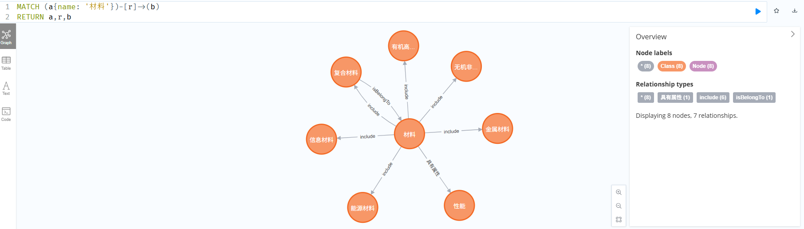
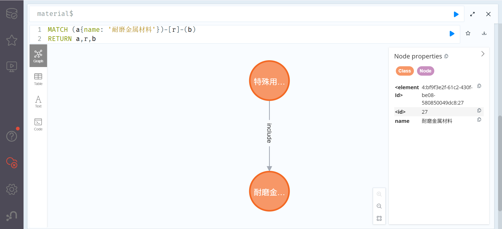

```
第1次调用 → 返回"高熵合金" → ❌ 不在列表
   ↓
添加纠正消息："你必须从这些选项中选择：钢铁, 有色金属材料..."
   ↓
第2次调用 → 返回"特殊用途金属材料" → ✅ 验证通过！
```
# 第一层
```
MATCH (a{name: '材料'})-[r]->(b)
RETURN a,r,b
```

结果：
```bash
(thl) thl@ubuntu:~/2025Fall/Mount-Data-to-KG/test$ python3 1_material_type.py 
--- 步骤1：正在从文件读取数据 ---
✅ 成功读取材料数据
✅ Neo4j 数据库连接成功！

--- 正在从Neo4j获取 '材料' (elementId=4:bf9f3e2f-61c2-430f-be08-580850049dc8:0) 的分类信息 ---
✅ 找到 7 个子类: 性能, 金属材料, 无机非金属材料, 信息材料, 能源材料, 复合材料, 有机高分子材料
   - 性能: 力学性能, 磁学性能, 加工性能, 光学性能, 环境性能...
   - 金属材料: 金属功能材料, 有色金属材料, 粉末冶金材料, 钢铁, 特殊用途金属材料
   - 无机非金属材料: (无例子)
   - 信息材料: 发光材料, 电子元器件材料, 半导体材料
   - 能源材料: 含能材料, 电池材料, 核能材料
   - 复合材料: 前沿新材料, 有色合金, gun barrel material, 材料
   - 有机高分子材料: (无例子)

--- 正在调用API生成任务描述 ---
✅ 生成的任务描述: 你的任务是判断材料属于性能、金属材料等哪个子类型，并将其挂载到知识图谱中。

待分类材料数据:
{
  "_id": "674742c7f10142971f5cf026",
  "_meta_id": 16609527,
  "_tid": 1007,
  "data": {
    "成分比重": {
      "Mn": 1.0,
      "Fe": 1.0,
      "Co": 1.0,
      "Cu": 1.0,
      "Nb": 2.0,
      "Ni": 1.0
    },
    "预测硬度": 609.8682083530902,
    "MGE18_标题": "Mn1Fe1Co1Ni1Cu1Nb2",
    "MGE18_摘要": "面向高熵合金的机器学习模型预测数据",
    "MGE18_DOI": "None",
    "MGE18_关键词": "硬度预测",
    "MGE18_来源": "self-production",
    "MGE18_引用": "",
    "MGE18_数据生产者": "liuan",
    "MGE18_数据生产机构": "ustb",
    "MGE18_方法": ""
  }
}

候选材料类型: 性能, 金属材料, 无机非金属材料, 信息材料, 能源材料, 复合材料, 有机高分子材料

--- 正在调用DeepSeek API进行材料分类 ---

========== System Prompt ==========
材料知识图谱是一个管理了各种材料的层次逻辑关系的树，你是这个智能图谱的节点挂载器。

你的任务是判断材料属于性能、金属材料等哪个子类型，并将其挂载到知识图谱中。

请根据材料的性质和用途，从以下材料类型中选择一个最合适的分类：

- 性能
  例子：力学性能, 磁学性能, 加工性能, 光学性能, 环境性能, 生物学性能, 物理性能, 热学性能, 电化学性能, 腐蚀性能

- 金属材料
  例子：金属功能材料, 有色金属材料, 粉末冶金材料, 钢铁, 特殊用途金属材料

- 无机非金属材料

- 信息材料
  例子：发光材料, 电子元器件材料, 半导体材料

- 能源材料
  例子：含能材料, 电池材料, 核能材料

- 复合材料
  例子：前沿新材料, 有色合金, gun barrel material, 材料

- 有机高分子材料

请只输出材料类型名称，不要有其他解释。
===================================

   - 正在发送请求到DeepSeek API (第1次)...
✅ API返回: 金属材料
✅ 验证通过！分类结果在候选列表中。

🎯 分类结果: 金属材料
🔌 Neo4j 数据库连接已关闭。
```
# 第二层
如果第一层结果为“金属材料”，则继续执行以下代码：
2_metal_material_type.py
```
MATCH (a{name: '金属材料'})-[r]->(b)
RETURN a,r,b
```
结果1
```bash
(thl) thl@ubuntu:~/2025Fall/Mount-Data-to-KG/test$ python3 2_metal_material_type.py 
--- 步骤1：正在从文件读取数据 ---
✅ 成功读取材料数据
✅ Neo4j 数据库连接成功！

============================================================
第一层分类：材料类型
============================================================

--- 正在从Neo4j获取 '材料' (elementId=4:bf9f3e2f-61c2-430f-be08-580850049dc8:0) 的分类信息 ---
✅ 找到 7 个子类: 性能, 金属材料, 无机非金属材料, 信息材料, 能源材料, 复合材料, 有机高分子材料
   - 性能: 力学性能, 磁学性能, 加工性能, 光学性能, 环境性能...
   - 金属材料: 金属功能材料, 有色金属材料, 粉末冶金材料, 钢铁, 特殊用途金属材料
   - 无机非金属材料: (无例子)
   - 信息材料: 发光材料, 电子元器件材料, 半导体材料
   - 能源材料: 含能材料, 电池材料, 核能材料
   - 复合材料: 前沿新材料, 有色合金, gun barrel material, 材料
   - 有机高分子材料: (无例子)
✅ 使用第一层分类: 金属材料

============================================================
第二层分类：金属材料子类型
============================================================

--- 正在从Neo4j获取 '金属材料' (elementId=4:bf9f3e2f-61c2-430f-be08-580850049dc8:1) 的分类信息 ---
✅ 找到 5 个子类: 金属功能材料, 有色金属材料, 粉末冶金材料, 钢铁, 特殊用途金属材料
   - 金属功能材料: (无例子)
   - 有色金属材料: 铜及铜合金, 钛及钛合金, 稀有金属及其合金, 贵金属及其合金, 镁及镁合金...
   - 粉末冶金材料: (无例子)
   - 钢铁: 合金钢, 非合金钢, 铁, metal material
   - 特殊用途金属材料: 高温合金, 金属间化合物, 高熵合金, 耐磨金属材料, 耐蚀合金

--- 正在调用API生成任务描述 ---
✅ 生成的任务描述: 你的任务是判断材料属于金属材料的哪个子类型，并将其挂载到知识图谱中。

待分类材料数据:
{
  "_id": "674742c7f10142971f5cf026",
  "_meta_id": 16609527,
  "_tid": 1007,
  "data": {
    "成分比重": {
      "Mn": 1.0,
      "Fe": 1.0,
      "Co": 1.0,
      "Cu": 1.0,
      "Nb": 2.0,
      "Ni": 1.0
    },
    "预测硬度": 609.8682083530902,
    "MGE18_标题": "Mn1Fe1Co1Ni1Cu1Nb2",
    "MGE18_摘要": "面向高熵合金的机器学习模型预测数据",
    "MGE18_DOI": "None",
    "MGE18_关键词": "硬度预测",
    "MGE18_来源": "self-production",
    "MGE18_引用": "",
    "MGE18_数据生产者": "liuan",
    "MGE18_数据生产机构": "ustb",
    "MGE18_方法": ""
  }
}

已知材料大类: 金属材料
候选子类型: 金属功能材料, 有色金属材料, 粉末冶金材料, 钢铁, 特殊用途金属材料

--- 正在调用DeepSeek API进行金属材料子类型分类 ---

========== System Prompt ==========
材料知识图谱是一个管理了各种材料的层次逻辑关系的树，你是这个智能图谱的节点挂载器。

你的任务是判断材料属于金属材料的哪个子类型，并将其挂载到知识图谱中。

已知材料属于"金属材料"大类。

请根据材料的成分、性质和用途，从以下金属材料子类型中选择一个最合适的分类：

- 金属功能材料：具有特殊物理、化学或生物功能的金属材料

- 有色金属材料：铁以外的金属及其合金（如铜、铝、镁、钛等）
  例子：铜及铜合金, 钛及钛合金, 稀有金属及其合金, 贵金属及其合金, 镁及镁合金, 铝及铝合金

- 粉末冶金材料：通过粉末冶金工艺制造的金属材料

- 钢铁：主要由铁和碳组成的合金
  例子：合金钢, 非合金钢, 铁, metal material

- 特殊用途金属材料：用于特定应用场景的金属材料
  例子：高温合金, 金属间化合物, 高熵合金, 耐磨金属材料, 耐蚀合金

请只输出子类型名称，不要有其他解释。
===================================

   - 正在发送请求到DeepSeek API (第1次)...
✅ API返回: 高熵合金
⚠️  警告：返回结果 '高熵合金' 不在候选列表中
   候选列表: 金属功能材料, 有色金属材料, 粉末冶金材料, 钢铁, 特殊用途金属材料
   - 正在重试，要求从候选列表中选择...
   - 正在发送请求到DeepSeek API (第2次)...
✅ API返回: 特殊用途金属材料
✅ 验证通过！分类结果在候选列表中。

🎯 金属材料子类型分类结果: 特殊用途金属材料
🔌 Neo4j 数据库连接已关闭。
```

# 第三层
找到“高熵合金”
```bash
(thl) thl@ubuntu:~/2025Fall/Mount-Data-to-KG/test$ python3 3_special_material_type.py 
--- 步骤1：正在从文件读取数据 ---
✅ 成功读取材料数据
✅ Neo4j 数据库连接成功！

============================================================
第一层分类：材料 → 材料类型
============================================================

--- 正在从Neo4j获取 '材料' (elementId=4:bf9f3e2f-61c2-430f-be08-580850049dc8:0) 的分类信息 ---
✅ 找到 7 个子类: 性能, 金属材料, 无机非金属材料, 信息材料, 能源材料, 复合材料, 有机高分子材料
   - 性能: 力学性能, 磁学性能, 加工性能, 光学性能, 环境性能...
   - 金属材料: 金属功能材料, 有色金属材料, 粉末冶金材料, 钢铁, 特殊用途金属材料
   - 无机非金属材料: (无例子)
   - 信息材料: 发光材料, 电子元器件材料, 半导体材料
   - 能源材料: 含能材料, 电池材料, 核能材料
   - 复合材料: 前沿新材料, 有色合金, gun barrel material, 材料
   - 有机高分子材料: (无例子)

--- 正在调用API生成任务描述 ---
✅ 生成的任务描述: 你的任务是判断材料属于性能、金属材料等哪个子类型，并将其挂载到图谱中。

候选类型: 性能, 金属材料, 无机非金属材料, 信息材料, 能源材料, 复合材料, 有机高分子材料

--- 正在调用DeepSeek API进行第一层分类 ---

========== System Prompt ==========
材料知识图谱是一个管理了各种材料的层次逻辑关系的树，你是这个智能图谱的节点挂载器。

你的任务是判断材料属于性能、金属材料等哪个子类型，并将其挂载到图谱中。

已知材料属于"材料"大类。

请根据材料的成分、性质和用途，从以下材料子类型中选择一个最合适的分类：

- 性能
  例子：力学性能, 磁学性能, 加工性能, 光学性能, 环境性能, 生物学性能, 物理性能, 热学性能, 电化学性能, 腐蚀性能

- 金属材料
  例子：金属功能材料, 有色金属材料, 粉末冶金材料, 钢铁, 特殊用途金属材料

- 无机非金属材料

- 信息材料
  例子：发光材料, 电子元器件材料, 半导体材料

- 能源材料
  例子：含能材料, 电池材料, 核能材料

- 复合材料
  例子：前沿新材料, 有色合金, gun barrel material, 材料

- 有机高分子材料

请只输出子类型名称，不要有其他解释。
===================================

   - 正在发送请求 (第1次)...
✅ API返回: 金属材料
✅ 验证通过！

🎯 第一层分类结果: 金属材料

============================================================
第二层分类：金属材料 → 子类型
============================================================

--- 正在从Neo4j获取 '金属材料' (elementId=4:bf9f3e2f-61c2-430f-be08-580850049dc8:1) 的分类信息 ---
✅ 找到 5 个子类: 金属功能材料, 有色金属材料, 粉末冶金材料, 钢铁, 特殊用途金属材料
   - 金属功能材料: (无例子)
   - 有色金属材料: 铜及铜合金, 钛及钛合金, 稀有金属及其合金, 贵金属及其合金, 镁及镁合金...
   - 粉末冶金材料: (无例子)
   - 钢铁: 合金钢, 非合金钢, 铁, metal material
   - 特殊用途金属材料: 高温合金, 金属间化合物, 高熵合金, 耐磨金属材料, 耐蚀合金

--- 正在调用API生成任务描述 ---
✅ 生成的任务描述: 你的任务是判断材料属于金属材料的哪个子类型。

候选子类型: 金属功能材料, 有色金属材料, 粉末冶金材料, 钢铁, 特殊用途金属材料

--- 正在调用DeepSeek API进行第二层分类 ---

========== System Prompt ==========
材料知识图谱是一个管理了各种材料的层次逻辑关系的树，你是这个智能图谱的节点挂载器。

你的任务是判断材料属于金属材料的哪个子类型。

已知材料属于"金属材料"大类。

请根据材料的成分、性质和用途，从以下金属材料子类型中选择一个最合适的分类：

- 金属功能材料

- 有色金属材料
  例子：铜及铜合金, 钛及钛合金, 稀有金属及其合金, 贵金属及其合金, 镁及镁合金, 铝及铝合金

- 粉末冶金材料

- 钢铁
  例子：合金钢, 非合金钢, 铁, metal material

- 特殊用途金属材料
  例子：高温合金, 金属间化合物, 高熵合金, 耐磨金属材料, 耐蚀合金

请只输出子类型名称，不要有其他解释。
===================================

   - 正在发送请求 (第1次)...
✅ API返回: 高熵合金
⚠️  警告：'高熵合金' 不在候选列表中
   候选: 金属功能材料, 有色金属材料, 粉末冶金材料, 钢铁, 特殊用途金属材料
   - 正在重试...
   - 正在发送请求 (第2次)...
✅ API返回: 特殊用途金属材料
✅ 验证通过！

🎯 第二层分类结果: 特殊用途金属材料

============================================================
第三层分类：特殊用途金属材料 → 具体类型
============================================================

--- 正在从Neo4j获取 '特殊用途金属材料' (elementId=4:bf9f3e2f-61c2-430f-be08-580850049dc8:6) 的分类信息 ---
✅ 找到 5 个子类: 高温合金, 金属间化合物, 高熵合金, 耐磨金属材料, 耐蚀合金
   - 高温合金: 贵金属高温合金, 高温合金, 高温合金, 高温合金, Rene95...
   - 金属间化合物: Co<sub>3</sub>Al, Ti3Al, M23(CB)6, Ti3Al, Ti3Al...
   - 高熵合金: 单相fcc高熵合金, Al1.5CrCuFeMnTi, (Fe0.25Co0.25Ni0.25Cr0.125Mo0.125)86B14, TbDyHoErTi, 6061Al...
   - 耐磨金属材料: 特殊用途金属材料
   - 耐蚀合金: 特殊用途金属材料

--- 正在调用API生成任务描述 ---
✅ 生成的任务描述: 你的任务是判断材料属于高温合金、金属间化合物等哪个子类型。

候选具体类型: 高温合金, 金属间化合物, 高熵合金, 耐磨金属材料, 耐蚀合金

--- 正在调用DeepSeek API进行第三层分类 ---

========== System Prompt ==========
材料知识图谱是一个管理了各种材料的层次逻辑关系的树，你是这个智能图谱的节点挂载器。

你的任务是判断材料属于高温合金、金属间化合物等哪个子类型。

已知材料属于"特殊用途金属材料"大类。

请根据材料的成分、性质和用途，从以下特殊用途金属材料子类型中选择一个最合适的分类：

- 高温合金
  例子：贵金属高温合金, 高温合金, 高温合金, 高温合金, Rene95, Pt-Rh, Mo-Si-B, Mo-Si-B, Mo-Si-B, Ir-Nb

- 金属间化合物
  例子：Co<sub>3</sub>Al, Ti3Al, M23(CB)6, Ti3Al, Ti3Al, Ni Ti, (Ti,Zr)(Ni,Cu,Al)2, Co3B, (Ti,Zr,Hf)(Ni,Cu,Al)2, Co7Mo6

- 高熵合金
  例子：单相fcc高熵合金, Al1.5CrCuFeMnTi, (Fe0.25Co0.25Ni0.25Cr0.125Mo0.125)86B14, TbDyHoErTi, 6061Al, Zr41.2Ti13.8Cu12.5Ni10Be22.5, BT25, FeCoNiCr0.5B, Fe, (Ti Zr Hf Nb Ta)C

- 耐磨金属材料
  例子：特殊用途金属材料

- 耐蚀合金
  例子：特殊用途金属材料

请只输出子类型名称，不要有其他解释。
===================================

   - 正在发送请求 (第1次)...
✅ API返回: 高熵合金
✅ 验证通过！

🎯 第三层分类结果: 高熵合金

============================================================
完整分类路径：
材料 → 金属材料 → 特殊用途金属材料 → 高熵合金
============================================================
🔌 Neo4j 数据库连接已关闭。
```

# 为什么会出现这种？
- 耐磨金属材料
  例子：特殊用途金属材料

- 耐蚀合金
  例子：特殊用途金属材料
高熵合金下面的分类是入边，所以我只能用入边查询。
